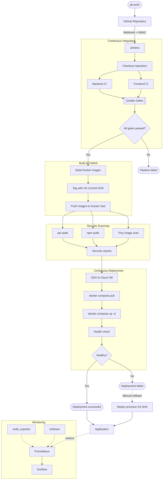

# Anime Backlog Tracker App

Self-hosted anime tracking app with a Next.js frontend, FastAPI backend, PostgreSQL database, CSV import/export, and anime metadata lookup from shikimori.io.

## Overview

This project is split into three main services:

- `frontend`: Next.js 16 app for the UI
- `backend`: FastAPI application with SQLAlchemy, Alembic, and business logic
- `db`: PostgreSQL 17 database

The main deployment path is Docker Compose with prebuilt Docker Hub images for the app services and the official PostgreSQL image for the database. A development overlay is also included for bind-mounted local development and local image builds.

## Architecture

### Frontend

- Framework: Next.js 16
- Language: TypeScript
- State/query layer: TanStack Query
- Forms: React Hook Form + Zod
- UI primitives: Radix UI

Key directories:

- `frontend/app`: app router pages
- `frontend/components`: shared layout and UI components
- `frontend/features`: feature-specific client code
- `frontend/lib`: API client, validation, utility code
- `frontend/tests`: Vitest tests

### Backend

- Framework: FastAPI
- ORM: SQLAlchemy 2
- Migrations: Alembic
- Settings: Pydantic Settings
- Driver: Psycopg 3

### Runtime

- `compose.yaml`: production-like stack
- `compose.dev.yaml`: local development overrides
- `Makefile`: common operational shortcuts
- `scripts/`: backup, restore, rsync deploy helpers

## Quick Start

### 1. Configure environment

Copy the example env files:

```sh
cp .env.example .env
```

Review at minimum:

- `POSTGRES_PASSWORD`
- `API_PROXY_TARGET`
- `CORS_ALLOW_ORIGINS`
- `AUTH_OWNER_USERNAME`
- `AUTH_OWNER_PASSWORD`
- `AUTH_SESSION_SECRET`
- `AUTH_LOGIN_MAX_FAILURES`
- `AUTH_LOGIN_WINDOW_SECONDS`
- `AUTH_LOGIN_LOCKOUT_SECONDS`
- published ports 
in `.env`

Default ports:

- frontend: `20773`
- backend API: `43968`
- PostgreSQL: `5432`

### 2. Pull and run

```sh
docker compose pull
docker compose up -d
``` 

## RESTful API 

API documentation is available at `http://hostname:43968/docs/`, where `43968` is the default API server's port.

---

# CI/CD Pipeline: anime-backlog-web


## 1. Infrastructure Preparation

### Terraform

Terraform is used to provision a virtual machine in Yandex Cloud. The main configuration file requests the following resources:

- 1 boot disk
- 1 virtual network
- 1 subnet
- 1 virtual machine with minimal specifications
- attachment of the disk and network to the VM

`cloud-terraform/main.tf`

### Cloud-init

Initial VM configuration (bootstrap), executed once on first boot:

- user creation
- SSH key addition

`cloud-terraform/cloud-init.yml`

### Ansible

More detailed configuration of the cloud VM instance:

- installation and configuration of Docker
- firewall setup
- installation of fail2ban
- hardening of sshd security

After the **Terraform → Cloud-init → Ansible** sequence, the virtual machine is fully prepared for application deployment.

`ansible/harden.yml`

---

## 2. Pipeline Trigger

A `git push` to the remote repository on GitHub causes GitHub to send a webhook to: https://jenkins.bernd32.xyz/github-webhook/

**Access security:**

| Resource | Access |
|---|---|
| `https://jenkins.bernd32.xyz` (Jenkins itself) | restricted to IP addresses allowed in the nginx configuration |
| `.../github-webhook/` (webhook endpoint) | open to all IP addresses, protected by HMAC signature of the payload |

Jenkins clones the repository and reads the declarative pipeline from `jenkins/Jenkinsfile`.

---

## 3. Quality Gates

Frontend and backend tests are executed **in parallel**, each within its own Docker container.

### Backend
- Container: `python:3.14-slim-bookworm`
- Creation of a virtual environment (venv)
- Installation of dependencies
- Execution of `pytest` with JUnit report generation
- `post.always` → publication of test results

### Frontend
- Container: `node:22-bookworm-slim`
- `npm ci`
- `typecheck`
- `npm test` (Vitest, JUnit report)
- `npm run build`
- `post.always` → publication of test results

---

## 4. Image Build and Publication

Docker images are built and pushed to the registry (**Docker Hub**) tagged with the **git-sha**.

This approach provides:
- reproducibility (ability to roll back to a specific tag)
- complete image history

---

## 5. Security Scanning

Scans are performed in **non-blocking** mode — they do not cause the build to fail but generate reports in the Jenkins dashboard.

| Tool | Scope |
|---|---|
| **pip-audit** | Python dependencies of the backend |
| **npm audit** | JS/TS dependencies of the frontend |
| **Trivy** | The complete built Docker image (immediately after the build) |

---

## 6. Deployment

On the remote virtual machine, with a secret `.env` file mounted via `withCredentials` (the file is not committed to the repository), the following command is executed:

```bash
docker compose up -d --remove-orphans --wait
```

using the newly built images. 

Unused images are removed after successful pipeline completion:

```bash
docker image prune -f
```

The application is accessible and ready to use at:

```
http://cloud-ip:20773
```

---

## 7. Monitoring

A **Grafana** dashboard is configured on the local server to monitor the local server hosting the "production" version of the application.

The **Prometheus + cAdvisor/node-exporter** stack tracks:

- overall server status (CPU / RAM / disk I/O)
- Docker containers statuses (filesystem usage, CPU, network, and memory per container)

---

## 8. Rollback Strategy

A dedicated pipeline is implemented for rollback: `jenkins/rollback/Jenkinsfile`.

**Procedure:**

1. Locate the last successful build of the required version in Jenkins
2. In the console output, find the line `Building commit XXXXXXXX` (the commit hash corresponds to the image tag on Docker Hub)
3. Navigate to the `anime-backlog-rollback` job in Jenkins
4. Select `Build with Parameters`
5. Paste the required commit hash into the `ROLLBACK_SHA` field
6. Start the build — the production version will be restored on the deployment server 

## Pipeline diagram



* Rollback is performed manually by redeploying Docker images tagged with the previous Git commit SHA. * 