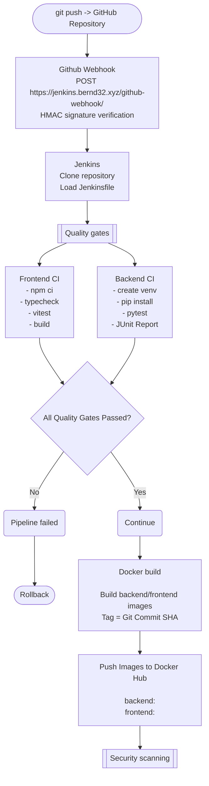

# CI/CD Pipeline

```mermaid
flowchart TD
    A([git push -> GitHub Repository]) --> B[Github Webhook<br>POST https://jenkins.bernd32.xyz/github-webhook/<br>HMAC signature verification]
    B --> C[Jenkins<br>Clone repository<br>Load Jenkinsfile]
    C --> D[[Quality gates]]
    D --> E[Backend CI<br>- create venv<br>- pip install<br>- pytest<br>- JUnit Report]
    D --> F[Frontend CI<br>- npm ci<br>- typecheck<br>- vitest<br>- build]
    F --> G{All Quality Gates Passed?}
    E --> G
    G -->|No| H(Pipeline failed)
    H --> I([Rollback])
    G -->|Yes| J(Continue)
    J --> K[Docker build<br><br>Build backend/frontend images<br>Tag = Git Commit SHA]
    K --> L[Push Images to Docker Hub<br><br>backend:<git-sha><br>frontend:<git-sha>]
    L --> M[[Security scanning]]
```