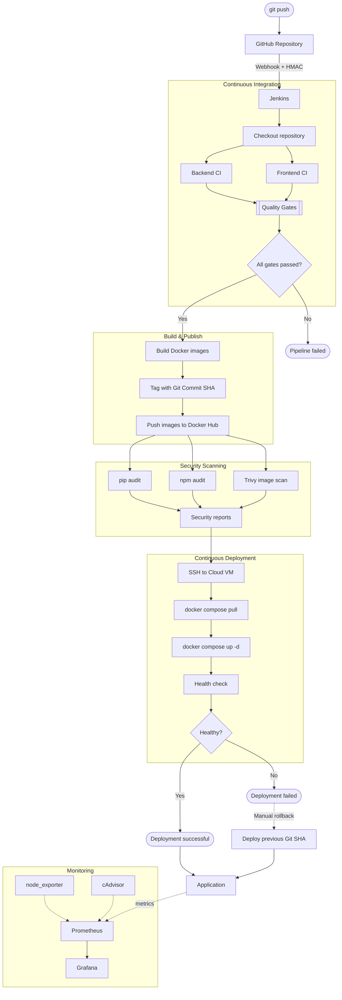

# CI/CD Pipeline

```mermaid
flowchart TD

A([git push]) --> B[GitHub Repository]
B -->|Webhook + HMAC| C[Jenkins]

subgraph CI["Continuous Integration"]
    C --> D[Checkout repository]
    D --> E[Backend CI]
    D --> F[Frontend CI]

    E --> G[[Quality Gates]]
    F --> G

    G --> H{All gates passed?}
end

H -->|No| I([Pipeline failed])
H -->|Yes| J[Build Docker images]

subgraph BUILD["Build & Publish"]
    J --> K[Tag with Git Commit SHA]
    K --> L[Push images to Docker Hub]
end

subgraph SECURITY["Security Scanning"]
    L --> M[pip audit]
    L --> N[npm audit]
    L --> O[Trivy image scan]

    M --> P[Security reports]
    N --> P
    O --> P
end

P --> Q[SSH to Cloud VM]

subgraph CD["Continuous Deployment"]
    Q --> R[docker compose pull]
    R --> S[docker compose up -d]
    S --> T[Health check]
    T --> U{Healthy?}
end

U -->|Yes| V([Deployment successful])
U -->|No| W([Deployment failed])

subgraph MON["Monitoring"]
    X[node_exporter]
    Y[cAdvisor]
    Z[Prometheus]
    AA[Grafana]

    X -.-> Z
    Y -.-> Z
    Z --> AA
end

V --> AB[Application]

AB -. metrics .-> Z

W -. Manual rollback .-> AC[Deploy previous Git SHA]
AC --> AB
```

* Rollback is performed manually by redeploying Docker images tagged with the previous Git commit SHA. * 